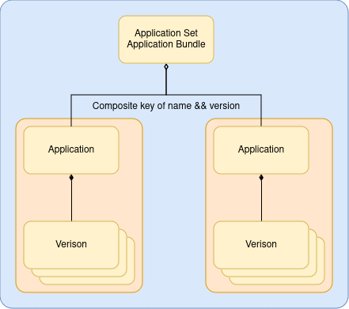

# Unikorn Core

## Overview

This is the shared core of Unikorn, it contains:

* generic custom resources
* generic CD integration
* generic provisioners
* generic manager frameworks
* generic server frameworks

## Core Architecture

Unikorn uses continuous deployment (CD) as the foundation of cluster provisioning.
By itself, CD is not up to the task of Kubernetes cluster provisioning and life-cycle management.
Neither are the methods offered by Cluster API (CAPI).
Unikorn provides the following functionality:

* Application ordering and gating
  * Applications can be deployed in a set order, and only after the previous one is healthy
  * Applications can be deployed concurrently where functionally required, or for performance, all applications must be healthy before execution can continue
* Remote cluster provisioning
  * Applications can be provisioned on a remote cluster e.g. one provisioned by Unikorn
* Dynamic application configuration
  * An opinionated API allows applications to be deployed to user demands
  * Unikorn provides methods to propagate these parameters to the underlying applications
* Provisioning hooks
  * These provide methods to hook into the CD application life-cycle and perform any remediation required due to bugs or deficiencies of the chosen CD backend

In summary, Unikorn is an engine for orchestrating complex CD deployments, that would otherwise be impossible to achieve.

## Unikorn Controllers

The controllers (aka operators) used by Unikorn are relatively simple.
They are based upon Controller Runtime and use this library wherever possible, this provides:

* Structured logging
* Caching Kubernetes clients
* Leadership election (to avoid split-brain)
* Monitoring of Unikorn custom resources
* Reconciliation management
  * Filtering of events prevents unwanted reconciliation unless something has actually changed

The core controller code is generic to provide consistency across all controllers.
The general algorithm is:

* Setup the context (detailed below)
* Get the requested resource
  * If not found, it has been deleted so end reconciliation
* If the deletion timestamp is set, it is being deleted
  * Run the deprovisioner
  * Update the custom resource status conditions
  * If an error occurred, re-queue the reconcile, otherwise remove the finalizer to allow deletion and end reconciliation
* Otherwise we reconcile, either creating or updating resources
  * Add the finalizer to the custom resource if not already set to allow controlled deletion
  * Run the provisioner
  * Update the custom resource status conditions
  * If an error occurred, re-queue the reconcile, otherwise end reconciliation

Like the core controller logic, the reconciler handles status conditions, regardless of the custom resource type, in a generic manner to provide consistency.

## Reconciler Context

The context contains a number of important values that can be propagated anywhere during reconciliation with only a single context parameter.
These are:

* Logger, provided by Controller Runtime
* A Kubernetes client scoped to the current provisioner system
  * By default this is the host system
  * This is used primarily by the application provisioner to create applications for the CD driver
* A cluster scoped to the current cluster that is being provisioned
  * By default this is the host system
  * When you invoke a provisioner in a remote cluster, this will be updated to that cluster
  * This is used primarily to get secrets created in that cluster by an application e.g. credentials that need to be exposed to higher layers, typically Kubernetes configurations for nested remote clusters
  * It can also be used for hacks where the provisioner needs direct access to resources on the system, but this is discouraged
* A CD driver that provides a generic interface to CD backends
* A reference to the controlling object (i.e. the custom resource) used to uniquely identify applications and remote clusters

## Provisioners and Deprovisioners

Everything in Unikorn's provisioning engine implements the Provisioner interface.
This is a very basic contract that says it will provision/deprovision as asked, returning nil, or either an `ErrYield` (meaning the error is expected and transient, and doesn't need to be reflected with an error status), or an actual unexpected error.

### Application Provisioner

This forms the core provisioner of Unikorn, and is responsible for:

* Looking up the application's versioning information e.g Helm repository, chart and version
  * This may also include static configuration describing how to provision the application e.g. parameters
* Generating dynamic parameters and values etc from the top level custom resource
* Creating a generic application definition and passing it to the CD driver for provisioning or deprovisioning
* Running any life-cycle hooks, that allow application specific hacks to be performed when the CD is broken in some way

### Remote Cluster Provisioner

Most CD tools allow you to manage applications on a remote Kubernetes instance.
For the most part this requires access to just a Kubernetes configuration file.
The remote cluster provisioner provides a way of managing the life-cycle of remote clusters.

The remote cluster provisioner is just a set of algorithms, to make it work you need to provide it with a driver that is able to retrieve the Kubernetes configuration.

It also doesn't actually implement the Provisioner interface, but acts as a factory that creates them when you wish to provision a child provisioner on the remote cluster.
When invoked, the child will be executed with a new context containing Kubernetes cluster information, including a client, that can directly access the remote cluster, and can be used in application life-cycle hooks.

The remote cluster provisioner will create the remote cluster via the CD driver when first provisioned, and will deprovision it after all children have been deprovisioned.

### Generic Provisioners

These provide the following functionality:

* Serial provisioner
  * Ordered provisioning where one child provisioner is dependent on another
  * It will return nil if all succeed, or the first error that is encountered
  * Deprovisioning will occur in reverse order
* Concurrent provisioner
  * Unordered provisioning where child provisioners can or must be provisioned independently of one another
  * It will return nil if all succeed, or the first error that is encountered
* Conditional provisioner
  * Allows provisioners to be run if a predicate is true
  * Deprovisions if the predicate is false in order to facilitate removal of a single provisioner
* Resource provisioner
  * For those times where you absolutely need to create a resource by hand, as opposed to via Helm
  * Use of this should be restricted

As alluded to generic provisioners operate on other provisioners, thus can be composed into really complex logic that cannot be done with CD tools.

For example, take Kubernetes cluster provisioning, when you create a cluster with CAPI, it will never become healthy until a Cloud Controller Manager (CCM) is installed, and a CNI.
With Unikorn this is simple:

* Create a cluster
* Concurrently...
  * Create a remote cluster when possible (i.e. the kubeconfig is available)
  * On the remote cluster...
    * Create the CCM and CNI concurrently

## Applications

Consider the following:

### Application Resources

Applications form the basis of all managed services in Unikorn.
Most managed resource types are a collection of applications managed by provisioners in a specific way to yield an end result.

Applications are defined only once e.g. there is only one instance of `cert-manager` in the system.
This aids in presenting applications to end-users in an application catalog, and keeps presentation logic simple.

Applications define metadata about the application: its source, documentation, license, icon etc.

Each application aggregates together a number of different versions.
Again this simplifies logic when determining whether an upgrade is available as we only need to look at the application to gather all the data we need.

Application versions define where to get the application from (typically a Helm repository, but it may refer to a GitHub branch for development purposes, or when a hot fix is not available via official channels).
They also define any static parameters that should be passed to the CD driver.
Where special handling is necessary by a provisioner, an interface version allows the provision to behave differently for different versions if Helm interfaces change.

### Application Sets/Bundles

Application sets conceptually are a set of versioned applications that are bundled together and applied to another managed resource, for example a set of optional applications that can installed on a Kubernetes cluster, and are user specified.

Application bundles are almost exactly the same.
Consider a Kubernetes cluster: that has an versioned application for the cluster, one for the CNI, another for the cloud controller manager etc.
They differ from application sets in that the set of applications is (mostly) static for that resource type, and they are _versioned_.

Application bundle versioning allows us to define and test a very limited set of permutations when it comes to resource provisioning and resource upgrade.
If it were free-for-all, then the number of permutations for testing is a really large polynomial that's impossible to test.
If we limit bundle versions to say N-2, then we only need worry about a single creation and two upgrade scenarios.

## CD Drivers

The CD driver does all the heavy lifting of the system, it implements:

* Application creation, update and deletion
* Remote cluster creation and deletion

A CD driver is a provider agnostic interface to application and remote cluster provisioning, thus it's important to only expose functionality things that all backends can implement.

Applications and remote clusters are referred to with an ID.
The ID comprises of a name and an ordered set of labels.
Either the ID's name must be globally unique, or a combination of the name and labels.
This is due to some CD solutions being scoped to a single namespace, and thus we need to consider how to prevent aliasing.

At present only Argo CD is implemented.

### Argo CD Driver

The Argo CD driver assumes that Argo CD is running in namepsaced mode (as opposed to cluster scoped mode), and therefore all applications and remote clusters will be provisioned in the same namespace.

Application names will be generated based on the application ID, so ensure these are kept within the 63 character limit.
Applications are retrieved based on label selectors containing at least the application name.
Applications may have an additional set of labels if the application name isn't unique within the host cluster and can be attached in the ID to ensure uniqueness, e.g. the control plane, project etc.

Remote clusters are handled similarly, using declarative configuration.
For legacy reasons, they will be named in the same way that Argo CD would name the secrets.
The server name, as referred to by applications and as shown in the UI, will be constructed by joining the remote cluster's name, and label values as provided in the remote cluster ID.
Like applications, care should be taken to ensure server names do not alias through either unique names or in conjunction with a unique set of labels.

When provisioning applications, the driver will return `ErrYield` if the application does not report healthy status.

The behavior is the same when deprovisioning applications, returning `ErrYield` until the application has been full deleted by ArgoCD.
You can enable a feature called "background deletion", which assumes success.
This is typically used when destroying a remote cluster, as the deletion of said cluster will also result in the deletion of all resources, and Argo CD will eventually remove applications referring to a non-existent remote cluster.

